# Diagrama de Fluxo Completo — Applied_ML

## Visão Geral

O projeto é um pipeline completo de **detecção automática de fraudes em notícias jornalísticas em português brasileiro**, desde a coleta de dados até a avaliação final de modelos e vinculação de empresas.

---

## Diagrama de Fluxo (Mermaid)

```mermaid
flowchart TD
    %% ===== FASE 1: COLETA DE DADOS =====
    subgraph FASE1["FASE 1 — Coleta Inicial (Jan–Fev 2026)"]
        A1["108.790 artigos<br/>5 portais jornalísticos SC"]
        A2["LLM gpt-oss:20b<br/>(Ollama) — Triagem automática"]
        A3["1.569 fraudes detectadas<br/>845 com empresas identificadas"]
        A4["+270 artigos manuais<br/>'983 test set'<br/>Portais gov/judiciais"]
        A5["Consolidação + Deduplicação<br/>845 + 270 − 65 = 1.050 artigos"]
        A6["DF_COMPANIES_26_02.csv<br/>(16 portais)"]

        A1 --> A2 --> A3
        A4 --> A5
        A3 --> A5 --> A6
    end

    %% ===== FASE 2: COLETA COMPLEMENTAR =====
    subgraph FASE2["FASE 2 — Coleta Complementar (Maio 2026)"]
        B1["1.180 artigos<br/>8 portais (scrapers Python)"]
        B2["LLM qwen3:8b<br/>(Ollama) — Classificação em 4 categorias"]
        B3["80 fraudes<br/>(26 empresariais + 54 gerais)"]
        B4["530 hard negatives<br/>196 pure negatives"]
        B5["JSONs classificados<br/>+ entidades extraídas<br/>(empresas, pessoas, tipos)"]

        B1 --> B2
        B2 --> B3
        B2 --> B4
        B3 --> B5
        B4 --> B5
    end

    %% ===== FASE 3: LIMPEZA DE VIÉS =====
    subgraph FASE3["FASE 3 — Limpeza de Viés Temático (Master/Vorcaro)"]
        C1["2.232 artigos<br/>1.050 CSV + 1.182 JSONs"]
        C2["Script clean_bias_datasets.py<br/>Redução seletiva → viés ≤ 5,87%"]
        C3["CSV: 1.050 → 886<br/>(−164 linhas, viés 20,57% → 5,87%)"]
        C4["JSONs: 1.182 → 1.036<br/>(−146 arquivos)"]
        C5["Dataset limpo<br/>cleaned_data_no_bias/"]

        C1 --> C2
        C2 --> C3
        C2 --> C4
        C3 --> C5
        C4 --> C5
    end

    %% ===== FASE 4: ENRIQUECIMENTO + BALANCEAMENTO =====
    subgraph FASE4["FASE 4 — Enriquecimento + Balanceamento"]
        D1["886 CSV limpo<br/>+ 47 JSONs fraud (8 corp + 39 gen)"]
        D2["Deduplicação por URL<br/>−47 duplicatas"]
        D3["882 exemplos POSITIVOS<br/>(22 portais)"]
        D4["989 negativos disponíveis<br/>(653 hard + 336 pure)"]
        D5["Amostragem estratificada<br/>por portal + tamanho"]
        D6["882 exemplos NEGATIVOS<br/>(583 hard 66,1% + 299 pure 33,9%)"]
        D7["DATASET FINAL<br/>1.764 artigos (882:882)<br/>33 portais | Jan 2020 – Jul 2025"]

        D1 --> D2 --> D3
        D4 --> D5 --> D6
        D3 --> D7
        D6 --> D7
    end

    %% ===== FASE 5: SPLIT + PRÉ-PROCESSAMENTO =====
    subgraph FASE5["FASE 5 — Divisão + Pré-processamento Dual"]
        E1["1.764 artigos"]
        E2["Split 80/20 estratificado"]
        E3["1.410 (80%) → Treino + Dev"]
        E4["353 (20%) → Teste<br/>(após limpeza: 334)"]
        E5["Treino: 1.128 (80%)<br/>Dev: 282 (20%)"]
        E6["Pré-processamento PESADO<br/>sem acentos, lowercase,<br/>sem stopwords/pontuação<br/>→ TRAIN/TEST_PREPROCESSED.csv"]
        E7["Pré-processamento LEVE<br/>preserva acentos,<br/>maiúsculas, pontuação<br/>→ TRAIN/TEST_BERT.csv"]

        E1 --> E2
        E2 --> E3
        E2 --> E4
        E3 --> E5
        E5 --> E6
        E5 --> E7
        E4 --> E6
        E4 --> E7
    end

    %% ===== FASE 6: VETORIZAÇÃO =====
    subgraph FASE6["FASE 6 — Vetorização (6 técnicas)"]
        F1["Texto Pré-processado<br/>(modelos clássicos)"]
        F2["Texto Original<br/>(modelos contextuais)"]
        F3["TF-IDF<br/>n-grams 1-2, 10k features<br/>matriz 1.410 × 10.000"]
        F4["FastText cc.pt.300d<br/>300 dim, média ponderada TF-IDF<br/>matriz 1.410 × 300"]
        F5["BERT-Base NeuralMind<br/>110M params, 768 dim<br/>matriz 1.410 × 768"]
        F6["BERT-Large NeuralMind<br/>335M params, 1.024 dim<br/>matriz 1.410 × 1.024"]
        F7["Albertina-Base PORTULAN<br/>138M params, DeBERTa, 768 dim<br/>matriz 1.410 × 768"]
        F8["Albertina-Large PORTULAN<br/>884M params, DeBERTa, 1.536 dim<br/>matriz 1.410 × 1.536"]

        F1 --> F3
        F1 --> F4
        F2 --> F5
        F2 --> F6
        F2 --> F7
        F2 --> F8
    end

    %% ===== FASE 7: TREINAMENTO =====
    subgraph FASE7["FASE 7 — Treinamento (18 combinações)"]
        G1["3 Classificadores<br/>NB · SVM · Random Forest"]
        G2["6 Vetorizações<br/>TF-IDF · FastText · BERT-B · BERT-L · Alb-B · Alb-L"]
        G3["18 combinações testadas<br/>5-fold CV no treino<br/>Avaliação no Dev (282)"]
        G4["Sem tuning de hiperparâmetros<br/>(configurações padrão)"]

        G1 --> G3
        G2 --> G3
        G4 --> G3
    end

    %% ===== FASE 8: RESULTADOS =====
    subgraph FASE8["FASE 8 — Resultados do Treinamento"]
        H1["TOP 5 (F1-Score no Dev)"]
        H2["1º TF-IDF + SVM — F1: 0,9783<br/>Precision: 100% (perfeita)"]
        H3["2º TF-IDF + NB — F1: 0,9565"]
        H4["3º TF-IDF + RF — F1: 0,9537"]
        H5["4º BERT-Large + SVM — F1: 0,9416"]
        H6["5º BERT-Base + SVM — F1: 0,9324"]

        H1 --> H2
        H1 --> H3
        H1 --> H4
        H1 --> H5
        H1 --> H6
    end

    %% ===== FASE 9: AVALIAÇÃO FINAL =====
    subgraph FASE9["FASE 9 — Avaliação Final no Teste"]
        I1["Modelo selecionado:<br/>TF-IDF + SVM"]
        I2["Teste inicial: 353 artigos<br/>F1: 0,9713"]
        I3["Verificação de data leakage<br/>19 duplicados (5,38%)"]
        I4["Teste limpo: 334 artigos<br/>F1: 0,9711<br/>Precision: 98,25%<br/>Recall: 96,00%<br/>ROC-AUC: 0,9921"]
        I5["Gap Dev→Teste: −0,74% F1<br/>Generalização confirmada"]

        I1 --> I2 --> I3 --> I4 --> I5
    end

    %% ===== FASE 10: COMPANY LINKAGE =====
    subgraph FASE10["FASE 10 — Vinculação de Empresas (Jun 2026)"]
        J1["175 notícias positivas do teste<br/>343 menções de empresas"]
        J2["Dataset oficial: 193.032 estabelecimentos<br/>(estabelecimento.csv)"]
        J3["3 métodos de matching:<br/>TF-IDF + Cosine · Fuzzy · Híbrido"]
        J4["337/343 vinculadas (98,3%)<br/>71 matches exatos (score > 0,9)"]

        J1 --> J3
        J2 --> J3
        J3 --> J4
    end

    %% ===== Conexões entre fases =====
    A6 --> C1
    B5 --> C1
    C5 --> D1
    C5 --> D4
    D7 --> E1
    E6 --> F1
    E7 --> F2
    F3 --> G2
    F4 --> G2
    F5 --> G2
    F6 --> G2
    F7 --> G2
    F8 --> G2
    G3 --> H1
    H2 --> I1
    I4 --> J1

    %% ===== Styling =====
    classDef phaseTitle fill:#e1f5fe,stroke:#01579b,stroke-width:2px
    classDef bestModel fill:#c8e6c9,stroke:#2e7d32,stroke-width:3px
    classDef finalResult fill:#fff9c4,stroke:#f57f17,stroke-width:2px
    classDef dataNode fill:#f3e5f5,stroke:#6a1b9a,stroke-width:1px

    class A6,D7,E4 dataNode
    class H2,I4 bestModel
    class I5,J4 finalResult
```



---

## Resumo Estruturado por Fase

### Fase 1 — Coleta Inicial (Jan–Fev 2026)
- **Fonte:** 5 portais jornalísticos de SC (108.790 artigos)
- **Triagem:** LLM `gpt-oss:20b` (Ollama) → 1.569 fraudes, 845 com empresas
- **Adição manual:** 270 artigos gov/judiciais ("983 test set")
- **Resultado:** `DF_COMPANIES_26_02.csv` — 1.050 artigos, 16 portais

### Fase 2 — Coleta Complementar (Maio 2026)
- **Fonte:** 8 portais, 1.180 artigos (scrapers Python: BBC, Jornal Conexão, etc.)
- **Classificação:** LLM `qwen3:8b` (Ollama) em 4 categorias
- **Resultado:** 80 fraudes (26 empresariais + 54 gerais), 530 hard negatives, 196 pure negatives
- **Entidades extraídas:** empresas, pessoas, tipos de fraude

### Fase 3 — Limpeza de Viés (Master/Vorcaro)
- **Problema:** Viés temático crítico — 20,57% no CSV, até 81,1% nos JSONs
- **Script:** `clean_bias_datasets.py` — redução seletiva
- **Resultado:** Viés reduzido para 5,87% (−85,6% médio), 1.036 JSONs + 886 CSV

### Fase 4 — Enriquecimento + Balanceamento
- **Positivo:** 886 CSV + 47 JSONs fraud → deduplicação → **882 exemplos** (22 portais)
- **Negativo:** 989 disponíveis → amostragem estratificada → **882 exemplos** (15 portais)
- **Dataset final:** 1.764 artigos (882:882), 33 portais, Jan 2020 – Jul 2025

### Fase 5 — Divisão + Pré-processamento Dual
- **Split 80/20:** 1.410 treino+dev / 353 teste (→ 334 após remoção de 19 duplicados)
- **Treino/Dev:** 1.128 treino (80%) / 282 dev (20%)
- **Pré-processamento dual:**
  - **Pesado** (sem acentos, lowercase, sem stopwords) → TF-IDF, FastText
  - **Leve** (preserva acentos/maiúsculas) → BERT, Albertina

### Fase 6 — Vetorização (6 técnicas)
| Técnica | Dimensões | Tipo | Texto |
|---------|-----------|------|-------|
| TF-IDF | 10.000 | Esparso | Pré-processado |
| FastText | 300 | Denso estático | Pré-processado |
| BERT-Base | 768 | Denso contextual | Original |
| BERT-Large | 1.024 | Denso contextual | Original |
| Albertina-Base | 768 | Denso contextual (DeBERTa) | Original |
| Albertina-Large | 1.536 | Denso contextual (DeBERTa) | Original |

### Fase 7 — Treinamento (18 combinações)
- **3 classificadores:** Naive Bayes, SVM (linear), Random Forest (100 estimators)
- **6 vetorizações × 3 classificadores = 18 combinações**
- **Sem tuning** — configurações padrão (requisito acadêmico)
- **Avaliação:** 5-fold CV no treino + métricas no dev (282 amostras)

### Fase 8 — Resultados (Top 5 no Dev)
| Rank | Vetorização | Classificador | F1-Score |
|------|-------------|---------------|----------|
| 1 | TF-IDF | SVM | **0,9783** |
| 2 | TF-IDF | Naive Bayes | 0,9565 |
| 3 | TF-IDF | Random Forest | 0,9537 |
| 4 | BERT-Large | SVM | 0,9416 |
| 5 | BERT-Base | SVM | 0,9324 |

### Fase 9 — Avaliação Final no Teste
- **Modelo:** TF-IDF + SVM (linear kernel)
- **Teste limpo:** 334 artigos (175 pos, 159 neg)
- **F1-Score: 0,9711** | Precision: 98,25% | Recall: 96,00% | ROC-AUC: 0,9921
- **Gap dev→teste:** −0,74% (generalização confirmada)
- **Data leakage:** 19 duplicados (5,38%), impacto −0,0002 F1 (negligenciável)

### Fase 10 — Vinculação de Empresas (Jun 2026)
- **Input:** 175 notícias positivas (343 menções) + 193.032 estabelecimentos oficiais
- **3 métodos:** TF-IDF + Cosine, Fuzzy String Matching, Híbrido (60% TF-IDF + 40% Fuzzy)
- **Resultado:** 337/343 empresas vinculadas (98,3%), 71 matches exatos

---

## Estrutura de Diretórios do Repositório

```
Applied_ML/
├── collector_noticias/          # Scrapers de portais (BBC, ICL, OlharSC, etc.)
├── dataset/
│   ├── raw_companies_hmg/       # 1 CSV com ~193k registros de estabelecimentos
│   ├── cleaned_data_no_bias/    # Dataset final limpo
│   │   ├── POSITIVE_DF_COMPANIES_REDUZIDO.csv   (882 exemplos)
│   │   ├── NEGATIVE_DATASET_STRATIFIED.csv      (882 exemplos)
│   │   └── FOR_TRAINING/        # Splits treino/teste + pré-processamento
│   └── classification_results/  # Resultados da classificação LLM
├── processors/                  # Scripts de processamento e análise
├── scripts/                     # Scripts de vetorização (TF-IDF, BERT, Albertina, FastText)
├── vectorization/               # Matrizes vetorizadas (tf_idf, bert_*, albertina_*, fasttext)
├── training/
│   ├── baseline_naive_bayes_tfidf.py
│   ├── evaluate_best_model_on_test.py
│   ├── generate_individual_reports.py
│   └── results/                 # 18 combinações + CONSOLIDACAO_FINAL.md
├── test/                        # Avaliação final no conjunto de teste
│   ├── dataset/                 # TEST_PREPROCESSED.csv + TEST_CLEAN_NO_DUPLICATES.csv
│   ├── model/                   # SVM.pkl + TF-IDF vectorizer.pkl + dados vetorizados
│   ├── results/                 # FINAL_TEST_REPORT.md + métricas
│   └── scripts/                 # vectorize_test_dataset.py + evaluate_best_model_on_test.py
├── companies_linkage/           # Vinculação empresas ↔ estabelecimentos oficiais
├── chronology/                  # Documentação cronológica (01–06)
└── Paper/                       # Artigo IEEE (Final.tex, Final.bib)
```
