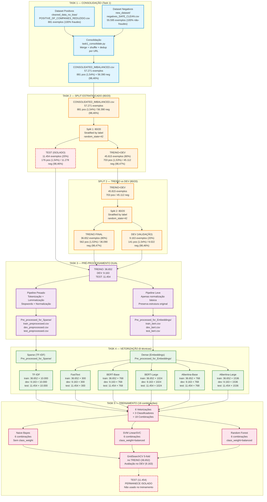

# Dataset Flow Diagram — NEW_training Pipeline

## Visão Geral

Pipeline completo de preparação de dados para detecção de fraudes em notícias, desde consolidação até splits estratificados para treinamento.

---

## Diagrama de Fluxo



---

## Resumo Quantitativo

### Distribuição Final dos Dados

| Split | Total | Positivos | % Pos | Negativos | % Neg | Uso |
|-------|-------|-----------|-------|-----------|-------|-----|
| **TREINO** | 36.652 | 562 | 1,53% | 36.090 | 98,47% | GridSearchCV 5-fold + retreino |
| **DEV** | 9.163 | 141 | 1,54% | 9.022 | 98,46% | Avaliação de modelos (Task 5) |
| **TEST** | 11.454 | 176 | 1,54% | 11.278 | 98,46% | **ISOLADO** — Task 7 apenas |
| **TOTAL** | 57.269 | 879 | 1,54% | 56.390 | 98,46% | - |

**Nota:** 2 exemplos perdidos na deduplicação entre splits (57.271 → 57.269)

### Proporções dos Splits

```
CONSOLIDATED (57.271)
    ├── TREINO+DEV (45.815) ——— 80%
    │   ├── TREINO (36.652) ——— 80% do TREINO+DEV
    │   └── DEV (9.163) ———————— 20% do TREINO+DEV
    └── TEST (11.454) ——————————— 20% (ISOLADO)
```

### Vetorizações Geradas

| Técnica | Tipo | Dimensões | Train | Dev | Test | Status |
|---------|------|-----------|-------|-----|------|--------|
| TF-IDF | Sparse | 10.000 | 36.652 | 9.163 | 11.454 | ✅ |
| FastText | Dense | 300 | 36.652 | 9.163 | 11.454 | ✅ |
| BERT-Base | Dense | 768 | 36.652 | 9.163 | 11.454 | ✅ |
| BERT-Large | Dense | 1.024 | 36.652 | 9.163 | 11.454 | ✅ |
| Albertina-Base | Dense | 768 | 36.652 | 9.163 | 11.454 | ✅ |
| Albertina-Large | Dense | 1.536 | 36.652 | 9.163 | 11.454 | ✅ |

### Combinações Treinadas (Task 5)

| Classificador | Vetorizações | class_weight | Total Combinações |
|---------------|--------------|--------------|-------------------|
| Naive Bayes | 6 | ❌ Sem ajuste | 6 |
| SVM LinearSVC | 6 | ✅ balanced | 6 |
| Random Forest | 6 | ✅ balanced | 6 |
| **TOTAL** | - | - | **18** |

**Melhor modelo (Task 6):** TF-IDF + SVM (F1=0.7075 no Dev)

---

## Estrutura de Diretórios

```
NEW_training/
├── FOR_TRAINING/                                       (Dados de treinamento)
│   ├── CONSOLIDATED_IMBALANCED.csv                     (57.271 — origem)
│   ├── DISTRIBUTION_REPORT.txt                         (relatório de distribuição)
│   ├── train.csv                                       (36.652 — treino)
│   ├── dev.csv                                         (9.163 — validação)
│   ├── Pre_processed_for_Sparse/
│   │   ├── train_preprocessed.csv                      (pesado — TF-IDF/FastText)
│   │   └── dev_preprocessed.csv
│   └── Pre_processed_for_Embeddings/
│       ├── train_bert.csv                              (leve — BERT/Albertina)
│       └── dev_bert.csv
│
├── FOR_TEST/                                           (Dados de teste — ISOLADO)
│   ├── test.csv                                        (11.454 — teste)
│   ├── Pre_processed_for_Sparse/
│   │   └── test_preprocessed.csv
│   └── Pre_processed_for_Embeddings/
│       └── test_bert.csv
│
├── vectorization/                                      (Vetorizações prontas)
│   ├── tfidf/
│   │   ├── train_sparse.npz                            (36.652 × 10.000)
│   │   ├── dev_sparse.npz                              (9.163 × 10.000)
│   │   ├── test_sparse.npz                             (11.454 × 10.000)
│   │   └── labels_{train,dev,test}.npy
│   ├── fasttext/
│   │   ├── train_embeddings.npy                        (36.652 × 300)
│   │   ├── dev_embeddings.npy                          (9.163 × 300)
│   │   ├── test_embeddings.npy                         (11.454 × 300)
│   │   └── labels_{train,dev,test}.npy
│   ├── bert_base/                                      (36.652/9.163/11.454 × 768)
│   ├── bert_large/                                     (36.652/9.163/11.454 × 1.024)
│   ├── albertina_base/                                 (36.652/9.163/11.454 × 768)
│   └── albertina_large/                                (36.652/9.163/11.454 × 1.536)
│
└── training/
    └── results/                                        (Resultados de treinamento)
        ├── tfidf/
        │   ├── naive_bayes/                            (model.pkl, best_params.json, report, cm)
        │   ├── svm/
        │   └── random_forest/
        ├── fasttext/
        │   ├── naive_bayes/
        │   ├── svm/
        │   └── random_forest/
        ├── bert_base/
        │   ├── naive_bayes/
        │   ├── svm/
        │   └── random_forest/
        ├── bert_large/
        │   ├── naive_bayes/
        │   ├── svm/
        │   └── random_forest/
        ├── albertina_base/
        │   ├── naive_bayes/
        │   ├── svm/
        │   └── random_forest/
        ├── albertina_large/
        │   ├── naive_bayes/
        │   ├── svm/
        │   └── random_forest/
        ├── naive_bayes/                                (consolidado por classificador)
        │   ├── EXPLICACAO_EXPERIMENTO.md
        │   ├── naive_bayes_comparison.csv
        │   ├── naive_bayes_comparison.png
        │   ├── naive_bayes_execution_log.txt
        │   └── naive_bayes_results.json
        ├── svm/
        │   ├── EXPLICACAO_EXPERIMENTO.md
        │   ├── svm_comparison.csv
        │   ├── svm_comparison.png
        │   ├── svm_execution_log.txt
        │   └── svm_results.json
        ├── random_forest/
        │   ├── EXPLICACAO_EXPERIMENTO.md
        │   ├── random_forest_comparison.csv
        │   ├── random_forest_comparison.png
        │   ├── random_forest_execution_log.txt
        │   └── random_forest_results.json
        └── CONSOLIDACAO_FINAL.md                       (Task 6 — análise dos 18 resultados)
```

---

## Características do Dataset

### Desbalanceamento

- **Classe positiva (fraudes):** 1,54% (879 de 57.269)
- **Classe negativa (não-fraudes):** 98,46% (56.390 de 57.269)
- **Razão:** ~1:64 (1 fraude para cada 64 não-fraudes)

### Estratificação

- ✅ Proporção mantida entre splits (1,53-1,54% em todos)
- ✅ Sem vazamento (deduplicação por URL entre splits)
- ✅ Shuffle com random_state=42 (reprodutível)

### Isolamento do Test Set

- ❌ **NÃO usado** em Task 1-5 (consolidação, split, pré-processamento, vetorização, treinamento)
- ❌ **NÃO usado** em GridSearchCV ou tuning de hiperparâmetros
- ❌ **NÃO usado** em seleção de modelos (Task 6)
- ✅ **SERÁ usado** apenas na Task 7 (avaliação final do melhor modelo)

---

**Gerado em:** 02/07/2026
